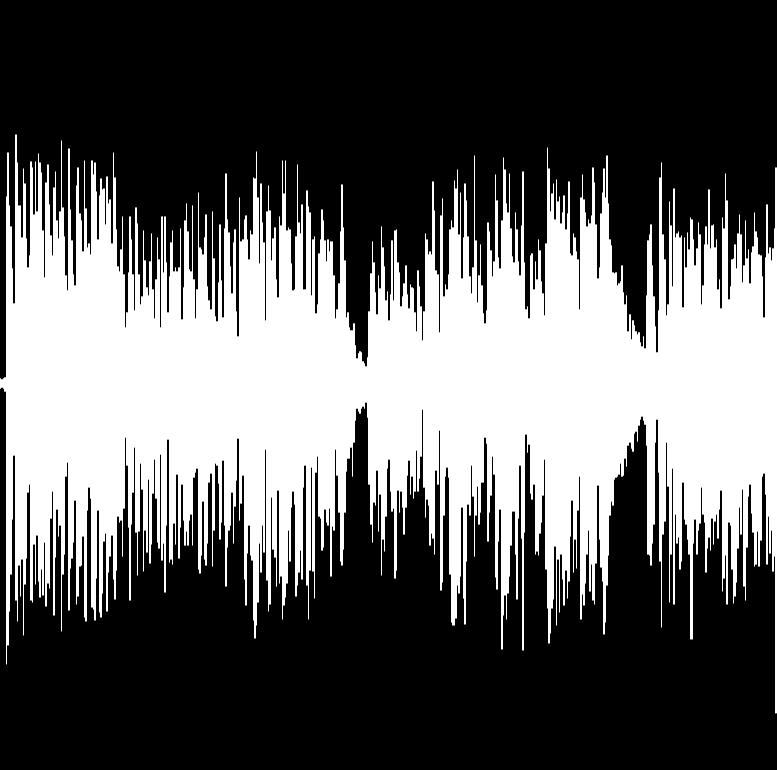

# UnityAudioWaveFormShader
Draw an audio wave form via shader in Unity.

Uses [ComputeBuffer](https://docs.unity3d.com/ScriptReference/ComputeBuffer.html) to send the calculated data to the shader.

Screenshot:

</src>